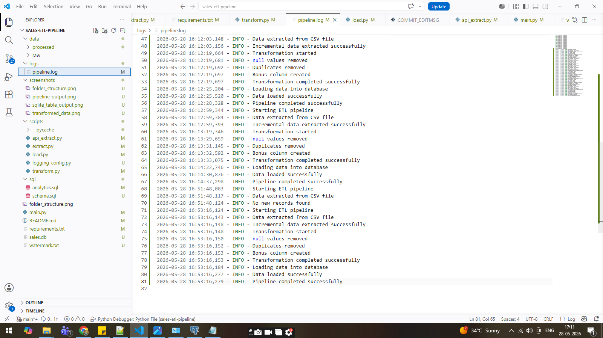
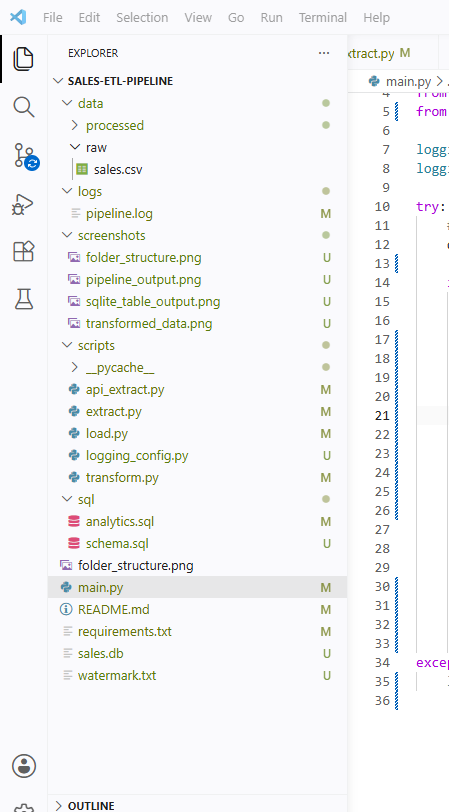

# Sales ETL Pipeline 🚀

A production-style ETL pipeline project built using Python, pandas, SQL, and SQLite with incremental loading and logging support.

---

# 📌 Project Overview

This project is an end-to-end ETL pipeline that extracts sales data from CSV/API sources, transforms and cleans the data using pandas, and loads the processed data into a SQLite database for analytics.

The project also includes:

* Incremental Loading
* Logging
* Error Handling
* SQL Analytics
* Processed CSV & JSON generation

---

# 🚀 Technologies Used

* Python
* pandas
* SQL
* SQLite
* SQLAlchemy
* requests
* Logging
* CSV / JSON

---

# 🏗️ Project Architecture

CSV/API
↓
Extract
↓
Transform
↓
Processed CSV/JSON
↓
SQLite Database
↓
SQL Analytics

---

# 📂 Folder Structure

sales-etl-pipeline/
│
├── data/
│   ├── raw/
│   │   └── sales.csv
│   │
│   └── processed/
│       ├── processed_sales.csv
│       └── processed_sales.json
│
├── scripts/
│   ├── extract.py
│   ├── transform.py
│   ├── load.py
│   ├── api_extract.py
│   └── logging_config.py
│
├── sql/
│   ├── schema.sql
│   └── analytics.sql
│
├── logs/
│   └── pipeline.log
│
├── screenshots/
│   ├── pipeline_output.png
│   ├── sql_query.png
│   ├── folder_structure.png
│   └── transformed_data.png
│
├── README.md
├── requirements.txt
├── watermark.txt
├── main.py
└── sales.db

---

# 🔥 Features

* ETL Pipeline
* CSV Data Extraction
* API Data Extraction
* Incremental Loading
* Data Cleaning
* Null Handling
* Duplicate Removal
* Bonus Calculation
* Logging
* Error Handling
* SQL Analytics
* Processed CSV & JSON Generation

---

# 🔄 ETL Flow

## 1. Extract

Data extracted from:

* CSV files
* APIs

---

## 2. Transform

Transformations performed:

* Null value handling
* Duplicate removal
* Bonus calculation
* Date formatting

---

## 3. Load

Processed data loaded into SQLite database for analytics.

---

# 📊 Sample SQL Analytics

## Total Sales by Category

```sql
SELECT category,
       SUM(amount) AS total_sales
FROM sales
GROUP BY category;
```

---

## Top Customers

```sql
SELECT customer_name,
       SUM(amount) AS total_amount
FROM sales
GROUP BY customer_name
ORDER BY total_amount DESC;
```

---

# ▶️ How to Run the Project

## Install Requirements

```bash
pip install -r requirements.txt
```

---

## Run Pipeline

```bash
python main.py
```

---

# 📸 Screenshots

## Pipeline Output



---

## SQL Query Output


---

## Folder Structure



---

## Transformed CSV Output


---

# 📌 Future Improvements

* CDC (Change Data Capture)
* Airflow Scheduling
* Docker Deployment
* Kafka Streaming
* Cloud Integration
* dbt Transformations

---

# 👨‍💻 Author

Rakesh Tati
Aspiring Data Engineer
